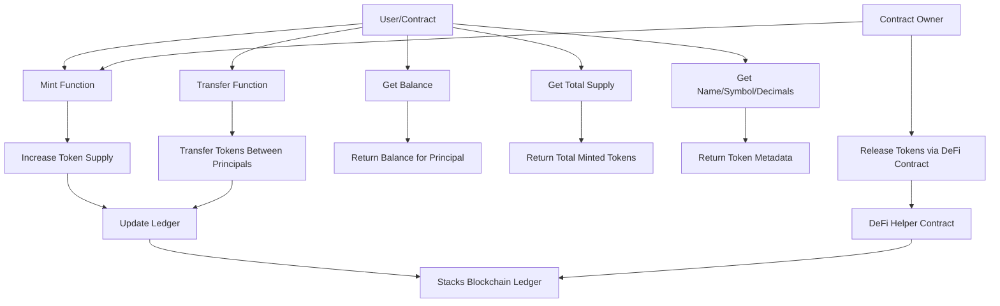

# Bradley Fungible Coin (sBC)

[](https://stacks.co/)
[](https://docs.hiro.so/stacks/clarinet)
[](https://github.com/stacksgov/sips/blob/main/sips/sip-010/sip-010-fungible-token-standard.md)
[](LICENSE)

A SIP-010 compliant fungible token on the Stacks blockchain, named "Bradley Coin" with symbol "sBC". This project demonstrates a basic fungible token implementation, suitable for learners and builders to understand and extend for real-world use cases like stablecoins, utility tokens, or DeFi assets.

## Table of Contents

- [Bradley Fungible Coin (sBC)](#bradley-fungible-coin-sbc)
  - [Table of Contents](#table-of-contents)
  - [Overview](#overview)
  - [Architecture](#architecture)
  - [Contract Functions](#contract-functions)
    - [Read-Only Functions](#read-only-functions)
    - [Public Functions](#public-functions)
    - [Error Codes](#error-codes)
  - [Deployment](#deployment)
    - [Prerequisites](#prerequisites)
    - [Steps](#steps)
  - [Testing](#testing)
  - [Usage Examples](#usage-examples)
    - [Minting Tokens](#minting-tokens)
    - [Transferring Tokens](#transferring-tokens)
    - [Integrating with DeFi](#integrating-with-defi)
  - [For Learners](#for-learners)
  - [For Builders](#for-builders)
  - [Resources](#resources)
  - [Contributing](#contributing)
  - [License](#license)

## Overview

Bradley Fungible Coin (sBC) is a digital asset built on the Stacks blockchain that adheres to the SIP-010 standard for fungible tokens. It allows for minting, transferring, and querying balances of tokens. The token has no maximum supply, 6 decimal places, and is owned by the contract deployer.

- **Token Name**: bradley coin cmbl
- **Symbol**: sBC
- **Decimals**: 6
- **Owner**: Contract deployer
- **URI**: https://hiro.so (placeholder for metadata)

This contract serves as a foundation for more complex token economies, including DeFi protocols, gaming assets, or community tokens.

## Architecture

The following Mermaid diagram illustrates the high-level architecture of the Bradley Fungible Coin contract:



- **Core Components**:
  - **Token Ledger**: Managed by Clarity's built-in fungible token functions.
  - **Owner Controls**: Minting restricted to contract owner.
  - **SIP-010 Compliance**: Ensures interoperability with wallets, exchanges, and other contracts.
  - **Helper Contract**: The `defi.clar` contract allows safe token releases.

## Contract Functions

### Read-Only Functions
- `get-balance (who principal)`: Returns the token balance of the specified principal.
- `get-total-supply`: Returns the total supply of tokens minted.
- `get-name`: Returns the token name ("bradley coin cmbl").
- `get-symbol`: Returns the token symbol ("sBC").
- `get-decimals`: Returns the decimal places (6).
- `get-token-uri`: Returns the metadata URI.

### Public Functions
- `mint (amount uint) (recipient principal)`: Mints new tokens to the recipient. Only callable by the contract owner.
- `transfer (amount uint) (from principal) (to principal) (memo (optional (buff 34)))`: Transfers tokens from one principal to another.

### Error Codes
- `ERR_OWNER_ONLY (u100)`: Thrown when a non-owner tries to mint.
- `ERR_NOT_TOKEN_OWNER (u101)`: Thrown when transferring more tokens than owned.

## Deployment

The contract has been successfully deployed to both testnet and mainnet.

### Deployed Contracts
- **Mainnet**:
  - Bradley Coin: [SPGDS0Y17973EN5TCHNHGJJ9B31XWQ5YX8A36C9B.bradley-coin](https://explorer.stacks.co/txid/SPGDS0Y17973EN5TCHNHGJJ9B31XWQ5YX8A36C9B.bradley-coin?chain=mainnet)
  - DeFi Helper: [SPGDS0Y17973EN5TCHNHGJJ9B31XWQ5YX8A36C9B.defiv2](https://explorer.stacks.co/txid/SPGDS0Y17973EN5TCHNHGJJ9B31XWQ5YX8A36C9B.defiv2?chain=mainnet)
  - Fungible Token (Old): [SPGDS0Y17973EN5TCHNHGJJ9B31XWQ5YX8A36C9B.fungible-token](https://explorer.stacks.co/txid/SPGDS0Y17973EN5TCHNHGJJ9B31XWQ5YX8A36C9B.fungible-token?chain=mainnet)
- **Testnet**:
  - Bradley Coin: [STGDS0Y17973EN5TCHNHGJJ9B31XWQ5YXBQ0KQ2Y.bradley-coin](https://explorer.stacks.co/txid/STGDS0Y17973EN5TCHNHGJJ9B31XWQ5YXBQ0KQ2Y.bradley-coin?chain=testnet)
  - DeFi Helper: [STGDS0Y17973EN5TCHNHGJJ9B31XWQ5YXBQ0KQ2Y.defiv2](https://explorer.stacks.co/txid/STGDS0Y17973EN5TCHNHGJJ9B31XWQ5YXBQ0KQ2Y.defiv2?chain=testnet)
  - Fungible Token (Old): [STGDS0Y17973EN5TCHNHGJJ9B31XWQ5YXBQ0KQ2Y.fungible-token](https://explorer.stacks.co/txid/STGDS0Y17973EN5TCHNHGJJ9B31XWQ5YXBQ0KQ2Y.fungible-token?chain=testnet)

### Prerequisites
- [Clarinet](https://docs.hiro.so/stacks/clarinet) installed.
- Stacks account with STX for fees.

### Steps
1. Clone the repository.
2. Configure [settings/Testnet.toml](settings/Testnet.toml) or [Mainnet.toml](settings/Mainnet.toml) with your deployer account.
3. Generate deployment plan: `clarinet deployments generate --testnet` (or `--mainnet`).
4. Apply deployment: `clarinet deployments apply --testnet`.

For mainnet deployment, ensure your account has sufficient STX and use a secure key management setup.

## Testing

Run tests with Clarinet:

```bash
clarinet test
```

Tests cover minting, transferring, and balance queries. See [tests/fungible-token.test.ts](tests/fungible-token.test.ts) for details.

Manual testing in Clarinet console:

```clarity
(contract-call? .fungible-token mint u100 tx-sender)
(contract-call? .fungible-token get-balance tx-sender)
```

## Usage Examples

### Minting Tokens
As the owner, mint 1000 tokens to a user:

```clarity
(contract-call? .fungible-token mint u1000000000 'ST1PQHQKV0RJXZFY1DGX8MNSNYVE3VGZJSRTPGZGM)
```

### Transferring Tokens
Transfer 50 tokens:

```clarity
(contract-call? .fungible-token transfer u50000000 tx-sender 'ST1SJ3DTE5DN7X54YDH5D64R3BCB6A2AG2ZQ8YPD5 none)
```

### Integrating with DeFi
Use the `defi.clar` helper to release tokens:

```clarity
(contract-call? .defi release-token u10000000 .fungible-token)
```

## For Learners

If you're new to Stacks and Clarity:

- **What is a Fungible Token?**: Indivisible digital assets that are interchangeable (e.g., currency).
- **SIP-010**: The standard ensures tokens work with Stacks ecosystem tools.
- **Clarity Language**: Functional, secure language for smart contracts. No loops or recursion to prevent exploits.
- **Key Concepts**:
  - **Principals**: Stacks addresses (user or contract).
  - **Traits**: Interfaces for contract interoperability.
  - **Built-ins**: Functions like `ft-mint?` for token operations.

Start by reading the [Clarity Book](https://book.clarity-lang.org/) and experimenting in the Clarinet console.

## For Builders

Extend this contract for advanced features:

- **Add Supply Cap**: Modify `mint` to check against a max supply.
- **Burning**: Add a `burn` function to reduce supply.
- **Staking/Rewards**: Integrate with other contracts for yield farming.
- **Multi-Owner Minting**: Use a list of authorized minters.
- **Metadata**: Update `TOKEN_URI` to point to IPFS or a dynamic endpoint.

Ensure changes maintain SIP-010 compliance. Test thoroughly on testnet before mainnet.

## Resources

- [SIP-010 Standard](https://github.com/stacksgov/sips/blob/main/sips/sip-010/sip-010-fungible-token-standard.md)
- [Clarity Documentation](https://docs.stacks.co/write-smart-contracts/clarity-language)
- [Clarinet Guide](https://docs.hiro.so/stacks/clarinet)
- [Stacks Explorer](https://explorer.stacks.co/)
- [Hiro Wallet](https://wallet.hiro.so/) for testing transactions.

## Contributing

Contributions welcome! Open issues or PRs for improvements. Follow Clarity best practices.

## License

MIT License. See [LICENSE](LICENSE) for details.
